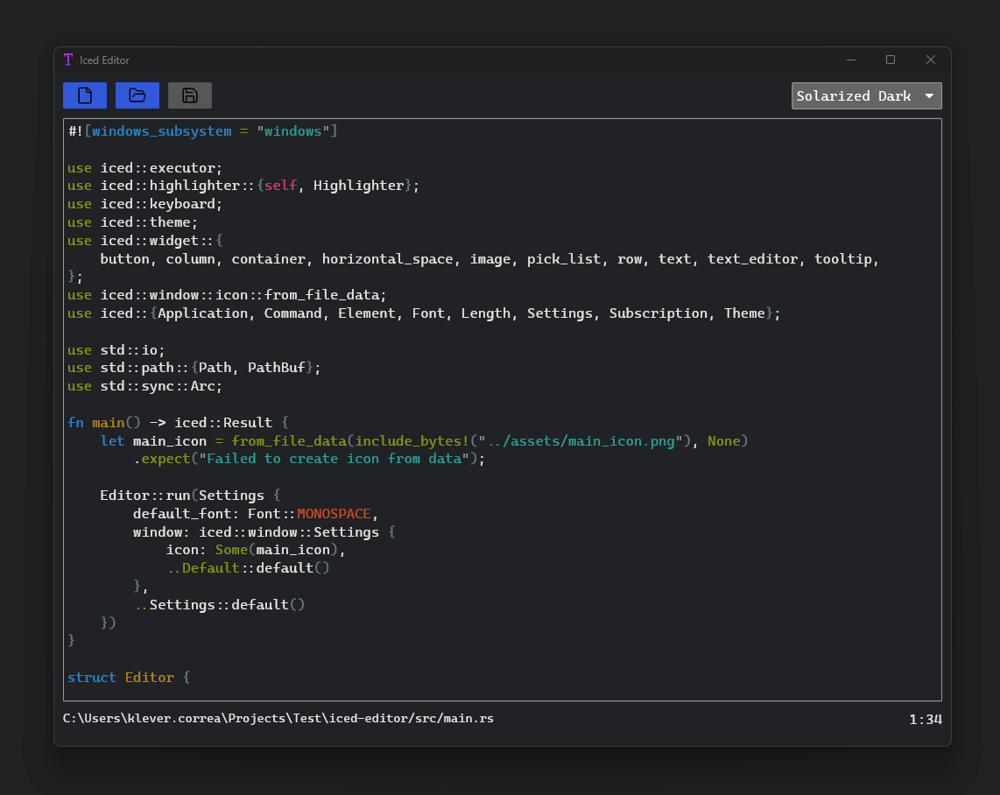

# Iced Editor

Iced Editor is a native text editor application written in Rust, utilizing the `iced` GUI library. It aims to provide a modern and efficient text editing experience with features such as:

- **Syntax Highlighting**: Supports syntax highlighting for various programming languages.
- **Asynchronous Tasks**: Utilizes `tokio` for handling asynchronous tasks efficiently.
- **Image Support**: Allows embedding images directly into the text editor.
- **Debugging**: Built-in debugging tools for a seamless development experience.
- **File Dialogs**: Uses `rfd` for native file dialogs, enhancing the user experience.

### Features

- **Cross-Platform**: Designed to work on multiple platforms, including Windows, macOS, and Linux.
- **Customizable Themes**: Offers a variety of themes to suit different preferences.
- **Auto-Save**: Automatically saves your work to prevent data loss.
- **Keyboard Shortcuts**: Includes keyboard shortcuts for common actions, improving efficiency.

### Getting Started

1. **Clone the Repository**: Clone the repository to your local machine.
2. **Install Rust**: Ensure you have Rust installed. You can download it from [rust-lang.org](https://www.rust-lang.org/tools/install).
3. **Run the Application**: Navigate to the project directory and run `cargo run` to start the application.

### Contributing

Contributions are welcome! Please feel free to submit a pull request or open an issue.

### License

This project is licensed under the MIT License. See the [LICENSE](LICENSE) file for details.